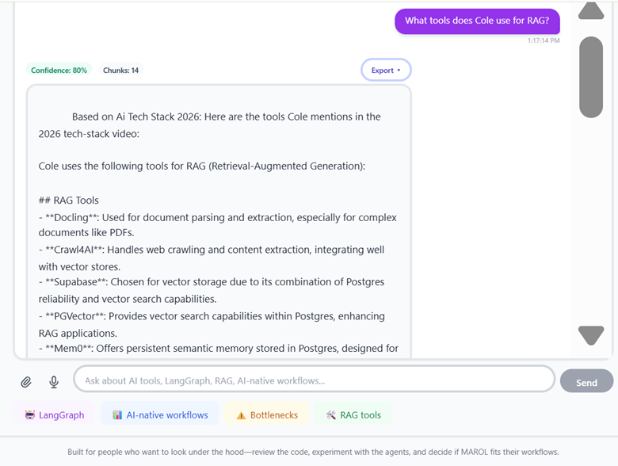

# MAROL - Multi-Agent Reasoning Orchestration Lab

**Upload a file. Ask a question. Get grounded answers over your own data.**

MAROL is documented here as a production RAG console and portfolio artifact for hiring managers, technical evaluators, and practitioners who want to see real multi-agent system design in practice.

<p align="center">
  
</p>

<p align="center">
  <a href="#try-it-in-30-seconds"></a>
  <a href="#current-production-status"></a>
  <a href="LICENSE"></a>
  <a href="https://github.com/VinodSridharan/MAROL-System-Overview/stargazers"></a>
</p>

---

## Try It in 30 Seconds

1. Upload a single PDF, DOCX, or image.
2. MAROL summarizes it and generates five focused questions about the file.
3. Click a question or ask your own.
4. Inspect the answer and its evidence badges to see exactly where it came from.

> Try your own file first.  
> The easiest way to understand MAROL is to upload one document and ask a few questions. All other features (YouTube, email, advanced workflows) build on the same grounded RAG engine.


### What It Looks Like



*MAROL console showing a file attach demo with grounded answer and evidence chips.*

> 📎 **Try your file first.**  
> The easiest way to understand MAROL is to upload one document and ask a few questions. Everything else (YouTube, email, advanced workflows) builds on that same grounded RAG engine.

---

## Why This System Is Useful

MAROL is a **Multi-Agent Reasoning Orchestration Lab** – a place to prototype, harden, and demo real-world RAG patterns that behave like teammates, not toys.

### Speed – File Attach & Voice That Feel Instant

- Short file attach demo: upload once, get a summary and five questions, then ask follow ups.
- Lightweight UI connects to a production backend (FastAPI + LangGraph), not a notebook.
- Designed for live demos and interviews where time is limited.

### Multilingual RAG – Proven on Tamil YouTube

- Ingests YouTube and audio, transcribes with Whisper, and builds a transcript backed RAG index.
- Shipped demo: a Gen AI concepts video in Tamil, with grounded Q&A in English or Tamil.
- Same pipeline can support other long form audio or video in many languages.

### Grounding & Safety – Answers You Can Inspect

- Router decides between Research, Direct, and Perfection modes based on question and tier.
- Ingestion agents handle files, YouTube/audio, and email archives in a unified index.
- Deployed on Google Cloud Run with Supabase/pgvector as a practical blueprint for production RAG.

### Orchestration – Multi-Agent Reasoning That Scales

- Router chooses between Research, Direct, and Perfection modes based on question and tier.
- Ingestion agents handle files, YouTube/audio, and email archives into a unified vector index.
- Deployed on Google Cloud Run with Supabase/pgvector – a realistic blueprint for production RAG.

---

## System Architecture

MAROL is a production RAG console built around three ideas:

- Multi-agent orchestration for routing and refinement.
- Strict grounding on curated corpora and transcripts.
- Tiered access for demos, evaluations, and collaborators.

---

## High-Level Data Flow

```text
[Browser UI]
   |
   v
[FastAPI Backend] --(LangGraph Orchestrator)--> [Agents]
   |
   +--> [Ingestion Pipelines]
   |       - File Uploads
   |       - YouTube / Audio
   |       - Email Archives
   |
   +--> [RAG Pipeline]
           - Text Cleaning & Chunking
           - Embeddings
           - Vector + Metadata Index (Supabase / pgvector)
           - Hybrid Retrieval (semantic + keyword)
           - Answer Synthesis w/ Evidence Badges
```

---

## Multi-Agent Orchestration

Router Agent decides between:

- Research (deeper multi-hop reasoning, more retrieval).
- Direct (fast answers for simple, well-scoped questions).
- Perfection (slower, high-quality refinement when stakes are higher).

Ingestion Agents handle:

- YouTube/audio: download, transcribe, chunk, and write transcript segments to the vector store.
- Files: parse PDFs/DOCX/images, run OCR where needed, and build document-centric chunks.
- Email: parse `.eml`, preserve threads and metadata, and expose message-level retrieval.

Safety & Guardrails Agent:

- Performs content and context checks.
- Can veto or soften an answer if evidence is weak or the request violates constraints.

---

## RAG Pipeline

### Ingestion

- Normalize input (text, HTML, audio transcripts).
- Chunk with overlap, preserving semantic boundaries where possible.

### Indexing

- Compute embeddings.
- Store embeddings, metadata, and corpus IDs in Supabase with pgvector.

### Retrieval

- Use semantic similarity and optional keyword filters.
- Apply per-session tenanting and tier limits.

### Synthesis

- Combine top chunks.
- Generate an answer that stays close to the source.
- Attach clickable evidence snippets.

---

## Deployment Architecture

### Backend

- Containerized FastAPI application.
- Built via Google Cloud Build and deployed to Google Cloud Run.

### Data Layer

- Supabase Postgres with pgvector for vector similarity search.

### Sessions & Tiers

- `marol_session_id` cookie identifies the current session.
- Supabase tracks usage and tier (demo, evaluation, collaborator) per session.

### Frontend

- Lightweight HTML + JavaScript console focused on:
  - File attach UX.
  - YouTube/URL entry.
  - Chat interface with evidence chips.
  - Tier/usage hints and modals.

---

## Text-Based Architecture Diagram

```text
+-------------------------+          +--------------------------+
|       Browser UI        |  HTTPS   |      Cloud Run (API)     |
|  - Upload form          +--------->+  - FastAPI               |
|  - YouTube URL field    |          |  - LangGraph Orchestrator|
|  - Chat + evidence view |          |  - Tier & session checks |
+-----------+-------------+          +------------+-------------+
            ^                                       |
            |                                       |
            |                         +-------------v-------------+
            |                         |      Ingestion Layer      |
            |                         | - File parsers            |
            |                         | - YouTube/Whisper client  |
            |                         | - Email parsers           |
            |                         +-------------+-------------+
            |                                       |
            |                                       v
            |                         +-------------+-------------+
            |                         |   Supabase (Postgres)     |
            |                         |   + pgvector extension    |
            |                         | - Chunks & embeddings     |
            |                         | - Sessions & tier usage   |
            |                         +-------------+-------------+
            |                                       ^
            |                                       |
            +---------------------------------------+
                      RAG retrieval & evidence
```

---

## Access Tiers

MAROL v2.3 introduces a tiered access system. This lets you safely demo the console while reserving deeper access for evaluators and collaborators.

| Tier        | Typical Use Case                              | Limits (example)      | What You Get                                                            | CTA                         |
|-------------|-----------------------------------------------|-----------------------|---------------------------------------------------------------------------|-----------------------------|
| Demo        | Quick interviews, first look at MAROL         | 1 file, 5 questions   | File attach demo, Tamil YouTube sample, evidence-badged answers          | Try demo in browser         |
| Evaluation  | Teams testing MAROL on their own documents    | Higher file & queries | Custom corpora, folder/email ingestion, more careful "Perfection" mode   | Request evaluation key      |
| Collaborator| Deep technical reviews & co-building          | Highest limits        | Access to more agents/flows, architecture sessions, code-level review    | Request collaborator access |

Upgrade path: start with Demo, then move to Evaluation when you want to test your own data. Collaborator access is for deeper technical partnerships and architecture reviews.


---

## v2.3 Capabilities

This README describes MAROL v2.3.0-alpha.1, focused on a robust tier backend, multimodal ingestion, and strong grounding.

### Tier System (Demo / Evaluation / Collaborator)

As summarized in **Access Tiers**, MAROL uses backend-enforced limits per session:

- Demo: 1 file, 5 questions.
- Evaluation & Collaborator: higher but controlled limits.

Tier information and usage are stored in Supabase tables keyed by `marol_session_id`.

### File Upload with Summaries + 5 Questions

Building on the "Try It in 30 Seconds" flow:

- Upload a single file in Demo tier.
- MAROL:
  - Parses and chunks the content.
  - Generates a short summary.
  - Produces 5 curated questions about that file.
  - Lets you click a question or type your own.
- Answers come with evidence chips that point to the exact chunks used.

### YouTube / Audio with Whisper

**Input:**

- YouTube URL.
- Supported audio file.

**Pipeline:**

- Download or accept audio.
- Transcribe via Whisper API.
- Chunk the transcript and embed segments.
- Route queries through the same RAG pipeline as documents.

This pipeline has been tested in production with a Tamil-language Gen AI explainer video, including correct retrieval and grounded Q&A.

### Multi-Agent Routing (Research / Direct / Perfection)

- Research for deeper, multi-hop questions.
- Direct for quick, low-latency responses when the mapping to chunks is straightforward.
- Perfection for high-stakes answers that benefit from multiple passes and explicit evidencing.
- Routing depends on question complexity, tier, and retrieval quality.

### Session Management

- MAROL assigns a `marol_session_id` cookie to each browser session.
- The backend uses this to:
  - Track tier-specific usage (files uploaded, queries made).
  - Enforce limits without requiring sign-up.
  - Provide consistent behavior across tabs and reloads for a given browser.

### Safety Harness (6 Checks)

MAROL's safety harness runs several checks per request, including:

- Tier limit check for file and query limits.
- Input size and shape check.
- Content safety check.
- Grounding check for enough evidence.
- Answer style check for clear, sourced responses.
- Fallback / "I do not know" path when retrieval is weak or the corpus is missing relevant information.

---

## Tech Stack

### Core Backend

- Language: Python 3.11
- Web Framework: FastAPI
- Orchestration: LangGraph-based multi-agent workflows for routing and refinement.
- Environment: Containerized app deployed to Google Cloud Run.

### Data & Storage

- Database: Supabase Postgres.
- Vector Store: pgvector extension in Supabase for semantic search.
- Object Storage: Used for uploaded files and intermediate artifacts (depending on deployment configuration).

### Retrieval & Reasoning

RAG pattern:

- Text normalization and chunking.
- Embeddings + pgvector similarity search.
- Hybrid retrieval (semantic + lexical where applicable).
- Answer generation with evidence highlighting.

Agents:

- Router, ingestion, safety, research, and refinement agents orchestrated via LangGraph.

### Frontend

- Lightweight HTML/JS console.
- Focused on:
  - File attach UX.
  - YouTube/URL entry.
  - Chat interface with evidence chips.
  - Tier/usage hints and upsell modals.

---

## Getting Started

This repository is a **system overview** and portfolio artifact, not a one-click product. It documents the live MAROL deployment and is designed to showcase production-grade multi-agent RAG design.


### 1. Try the Demo (When Available)

When the public demo is open, the README or repository header will include a Demo URL.

Recommended flow:

- Open the demo link.
- Upload a single PDF.
- Click one of the suggested questions.
- Inspect the answer and its evidence.
- Optionally, paste a YouTube URL and ask a question about the video.

If no demo URL is shown, the environment is currently restricted to evaluation and collaborator tiers.

### 2. Request Access (Evaluation or Collaborator)

If you want to evaluate MAROL with your own data or explore collaboration:

Send an email with:

- Subject: `MAROL Evaluation Request` or `MAROL Collaboration`.
- Contents:
  - Your role and team.
  - Types of data you want to evaluate (e.g., specs, SOPs, tickets).
  - What you'd like to learn from the evaluation.

You'll receive:

- A short questionnaire.
- A proposed evaluation scope (datasets, questions, success criteria).
- A suggested timeline and mode (async or live session).

---

## Documentation

This `MAROL-System-Overview` repo is the public documentation layer for the MAROL project.

Key files (may evolve):

- `README.md` – high-level overview (this file).
- `llms.txt` – lightweight system manifest for LLMs and agents.
- `CHANGELOG.md` – version history and capability changes.
- `docs/ARCHITECTURE.md` – deeper technical design and data flow.
- `screenshots/` – demo screenshots (file attach, Tamil YouTube, evidence view, tier modals).

For deeper design docs, incident playbooks, or architecture diagrams, reach out via the contact in Analytics & Engagement.

---

## Acknowledgments

MAROL stands on the shoulders of excellent open-source projects and prior work:

- Cole Medin (`coleam00`) – Early LangGraph RAG patterns and orchestration ideas that influenced MAROL's multi-agent design.
- LangChain / LangGraph – Foundational frameworks for agentic orchestration and RAG workflows.
- Supabase – Open-source backend infrastructure powering Postgres, authentication, and pgvector.
- OpenAI – GPT-4o and related APIs used for reasoning and generation.
- FastAPI – The Python web framework that makes the backend fast, type-safe, and interview-friendly.

---

## Analytics & Engagement

<p align="center">
  
  
  
  
</p>

Star this repo if you find it valuable for your learning, interviews, or understanding of production RAG systems.

Questions or collaboration? Email [vinod.sridharan@txvault.app](mailto:vinod.sridharan@txvault.app) or connect on LinkedIn.

---

## Current Production Status

- Version: v2.3.0-alpha.1
- Deployed To: Google Cloud Run (backend), with Supabase for storage and vector search.
- Last Updated: January 29, 2026
- Status: Production (demo and evaluation usage), with ongoing refinements towards v2.3.0 stable.

<div align="center">
Built by Vinod Sridharan<br/>
Portfolio artifact demonstrating production-grade multi-agent RAG system design and advanced LLM orchestration<br/>
Latest Update: January 29, 2026 | Status: Production | Version: v2.3.0-alpha.1
</div>

