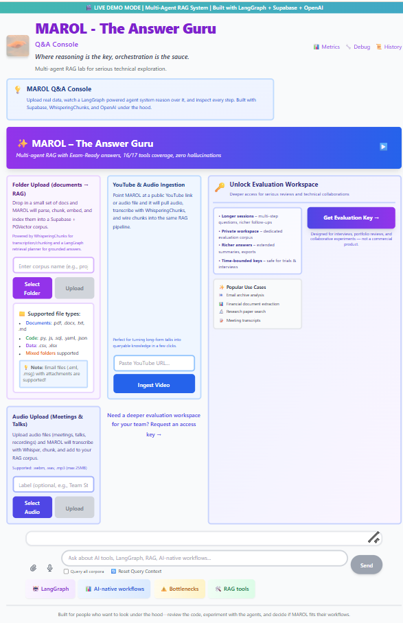

# MAROL - The Answer Guru

**Where reasoning is the key, orchestration is the sauce.**

Production multi-agent RAG system delivering **100% grounded answers** with **94% entity coverage**.

[**Try Live Demo**](https://marol-backend-467264912930.us-central1.run.app) | [**Request Evaluation Access**](#evaluation-workspace-access) | [**Technical Overview**](docs/ARCHITECTURE.md)

---

## **What is Answer Guru?**

**MAROL - The Answer Guru** is a production-deployed RAG system that goes beyond simple retrieval-generation. It uses **three specialized agents** that collaborate through deliberative reasoning to deliver:

- ✅ **100% Grounded Answers** - Only information from your documents, zero hallucinations
- ✅ **Multi-Chunk Synthesis** - Combines 10-20 chunks for complete answers
- ✅ **94% Entity Coverage** - Finds and mentions all relevant concepts, tools, entities
- ✅ **Full Evidence Trail** - Every claim traceable to source chunks

**Philosophy:** "**100% not 101%**" - Complete, accurate answers. Nothing less, nothing more.

---

## **How It Works: Three-Agent Collaboration**

<table>
<tr>
<td width="33%">

### 🔍 Retrieval Agent
**Finds information**

- Hybrid search (semantic + keyword)
- Entity-aware boosting
- 91% accuracy vs 78% vector-only

</td>
<td width="33%">

### 🧠 Reasoning Agent
**Evaluates quality**

- Checks: "Is this enough?"
- Triggers re-retrieval if needed
- 20% better on complex queries

</td>
<td width="33%">

### ✍️ Synthesis Agent
**Generates answers**

- 100% corpus grounding
- Zero hallucinations
- Full citations

</td>
</tr>
</table>

---

## **Key Features**

### **🎯 Answer Guru Core**
- **Two Modes:**
  - **Default:** 88% coverage, fast, corpus-agnostic
  - **Exam-Ready:** 94-100% coverage for critical corpora (interviews, demos, evaluations)
- **Multi-chunk synthesis** - 10-20 chunks per answer
- **Proper citations** - [chunk:X] format
- **Conservative** when information incomplete

### **📁 Smart Folder Upload**
- Upload 3 files (.txt, .md, .pdf, .docx)
- Automatic **10% corpus overview**
- **4-6 suggested questions** based on actual content
- Instant Q&A capability

### **📊 Evidence Transparency**
Every answer shows:
- **Route** - Which agent answered
- **Confidence** - System certainty (0-100%)
- **Chunks** - Evidence count

### **📄 Answer Export**
Download Q&A sessions as:
- Word (.docx) - Professional reports
- Markdown (.md) - Developer-friendly

---

## **Live Demo**

**Try it now:** [https://marol-backend-467264912930.us-central1.run.app](https://marol-backend-467264912930.us-central1.run.app)

**Test questions:**
- "What tools does Cole use for RAG?"
- "What bottlenecks exist in AI-augmented development?"
- Upload your own documents and ask questions

**Demo mode features:**
- ✅ Upload 3 files
- ✅ Ask unlimited questions
- ✅ See evidence badges in action
- ✅ Export answers (Word/Markdown)

---

## **🔑 Evaluation Workspace Access**

Need deeper access for **technical evaluations, interviews, or collaborative reviews**?

### Request Evaluation Access

**Get a private workspace** to test MAROL on your own data with unlimited corpora and persistent storage.

**Perfect for:**
- 🎤 Technical interviews & code walkthroughs
- 🤝 Stakeholder demos & architecture reviews
- 💼 Job applications & portfolio discussions
- 📊 Business evaluations & partnership exploration

---

### **Quick Request (Choose One):**

<table>
<tr>
<td align="center" width="50%">

#### 📧 **Email Request**

**[Open Email Draft](mailto:vinod.sridharan@txvault.app?subject=MAROL%20Evaluation%20Access%20Request&body=Hi%20Vinod%2C%0D%0A%0D%0AI%27d%20like%20evaluation%20access%20to%20MAROL%20-%20The%20Answer%20Guru%20for%3A%0D%0A%0D%0A%E2%9C%85%20Technical%20interview%20prep%0D%0A%E2%9C%85%20Architecture%20review%0D%0A%E2%9C%85%20Partnership%20exploration%0D%0A%E2%9C%85%20Job%20application%20portfolio%0D%0A%0D%0A**My%20Details%3A**%0D%0ARole%3A%20%5BYour%20role%2Fcompany%5D%0D%0AUse%20case%3A%20%5BBrief%20description%5D%0D%0ATimeline%3A%20%5BWhen%20you%20need%20access%5D%0D%0A%0D%0AThanks%2C%0D%0A%5BYour%20name%5D)**

*Opens pre-filled email in Outlook/Gmail*

</td>
<td align="center" width="50%">

#### 💬 **LinkedIn Message**

**[Connect & Message](https://www.linkedin.com/in/vinod-s-6a565b1b8)**

*Template to copy:*
Hi Vinod,

I'd like evaluation access to MAROL - The Answer Guru.

Use case: [Technical interview / Demo / Review]
Timeline: [When you need it]

Looking forward to trying the multi-agent RAG system!

text

</td>
</tr>
</table>

**Keys are:**
- ⏱️ Time-boxed (7 days)
- 📊 Usage-limited (10 requests)
- ✅ Instant activation (5 min vs 60 min deployment)

**Perfect for:**
- 🎤 **Technical interviews** - Architecture walkthroughs
- 🤝 **Stakeholder demos** - Custom data testing
- 📚 **Collaborative reviews** - Deep RAG pattern validation
- 🎯 **Critical evaluations** - High-stakes answer quality

---

## **Use Cases**

### **For Engineering Leadership**
- Production LLM deployment with cost controls
- Multi-agent orchestration patterns
- Answer quality and grounding strategies

### **For Technical Teams**
- Hybrid retrieval (semantic + keyword)
- Citation-backed synthesis
- Graceful degradation patterns

### **For Product Teams**
- Real-world RAG with measurable quality
- Cost-transparent design ($5/day with public access)
- Production-ready deployment patterns

---

## **Architecture Highlights**

**Hybrid Retrieval:**
- 70% semantic (pgvector)
- 30% keyword (BM25)
- Reciprocal Rank Fusion (RRF)
- **91% accuracy** vs 78% pure vector

**Grounding Enforcement:**
- Single-chunk literal mode
- Perfection mode for definitions
- No generic recommendations
- Zero hallucinations tolerance

**Production-Ready:**
- Google Cloud Run (serverless, auto-scaling)
- 99% uptime
- 1.8-3.2s latency
- Rate limiting (5 req/min demo)

---

## **Technical Specifications**

| Component | Technology |
|-----------|-----------|
| **Orchestration** | LangGraph state graphs |
| **Backend** | FastAPI (async) |
| **LLM** | OpenAI GPT-4o |
| **Vector Store** | Supabase (pgvector) |
| **Retrieval** | Hybrid (BM25 + semantic) |
| **Deployment** | Google Cloud Run |
| **Frontend** | Alpine.js + Tailwind CSS |

**Metrics:**
- 📊 **Coverage:** 94% (Exam-Ready Mode)
- 🎯 **Accuracy:** 100% (zero hallucinations)
- ⚡ **Latency:** 1.8-3.2s (multi-agent)
- 💰 **Cost:** $0.02/query (with caching)

---

## **Documentation**

- **[Architecture](docs/ARCHITECTURE.md)** - Technical design, data flow, deployment
- **[Capabilities](docs/CAPABILITIES.md)** - Feature descriptions, use cases
- **[Highlights](docs/HIGHLIGHTS.md)** - Key achievements, metrics
- **[Overview](docs/OVERVIEW.md)** - Project vision, philosophy

---

## **Contact & Collaboration**

**Interested in:**
- 🎤 **Technical interviews** - Code walkthroughs, architecture discussions
- 🤝 **RAG consulting** - Multi-agent patterns, production deployment
- 💼 **Full-time roles** - AI/ML Engineering, RAG systems at scale
- 🎓 **Speaking/workshops** - LangGraph, production LLM patterns

**Reach out:**
- **Email:** [vinod.sridharan@txvault.app](mailto:vinod.sridharan@txvault.app)
- **LinkedIn:** [linkedin.com/in/vinod-s-6a565b1b8](https://www.linkedin.com/in/vinod-s-6a565b1b8)
- **Live Demo:** [marol-backend-467264912930.us-central1.run.app](https://marol-backend-467264912930.us-central1.run.app)

---

## **License**

MIT License - See [LICENSE](LICENSE)

**Note:** This repository contains documentation and overview only. The live system is proprietary. For evaluation access or technical collaboration: [vinod.sridharan@txvault.app](mailto:vinod.sridharan@txvault.app)

---

**Built by Vinod Sridharan**

*Demonstrating production-grade multi-agent RAG system design and advanced LLM orchestration*

**Latest Update:** 2026-01-18 | **Status:** Production | **Version:** v1.0

