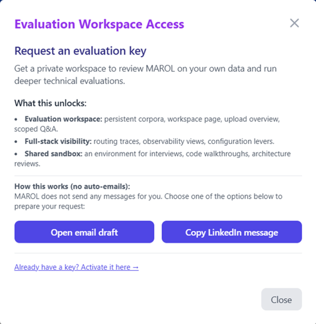

# MAROL – The Answer Guru  
System Overview

**Where reasoning is the key, orchestration is the sauce.**

Production multi‑agent RAG lab on Google Cloud Run delivering **Exam‑Ready answers**, **16/17 tools coverage**, and **zero hallucinations** on curated corpora.

[**🚀 Try Live Demo**](https://marol-backend-467264912930.us-central1.run.app) · [**📚 Technical Architecture**](docs/ARCHITECTURE.md) · [**⭐ Star this repo**](https://github.com/VinodSridharan/MAROL-System-Overview)

---

## 🎯 Hero pitch

Imagine if Cole's training prowess and Nate's futuristic vision lived in one corpus: a production RAG lab where multi‑agent workflows, Exam‑Ready evaluations, and long‑form audio corpora all converge on real engineering problems.  

**MAROL – The Answer Guru** is that lab: a Cloud Run–hosted, multi‑agent RAG system that turns messy, mixed‑format corpora into grounded, evidence‑backed answers you can safely put in front of stakeholders. This repo is the **System Overview**—architecture, timelines, and design notes for people who care how production AI systems are actually built.

---

## ✨ Why this is different

- **🎭 Multi‑agent orchestration that feels production‑grade** – LangGraph state graphs coordinate Research, Direct, and Perfection flows instead of a single "chat completion" call
- **🎙️ Audio & YouTube pipelines via WhisperingChunks** – a separate transcription + chunking service (its own repo and deployment) that feeds long‑form talks and videos into MAROL as searchable corpora via APIs
- **🎯 Exam‑Ready evaluation harness** – frozen baselines, corpus‑specific questions, and routing that hit 16/17 tools with 100% grounding on critical test sets
- **📊 Evidence‑badged answers** – every response carries route, confidence, and chunk counts so reviewers can audit reasoning, not just outputs
- **☁️ Cloud‑native deployment** – FastAPI + LangGraph backend, Supabase (pgvector) store, and serverless scaling on Google Cloud Run with real latency and cost numbers
- **💳 Safe, payment‑aware flows** – Stripe‑adjacent questions are handled conservatively and grounded, showing how to treat risk‑sensitive topics in a RAG system
- **📈 Eval‑driven development** – retrieval, prompts, and orchestration are tuned against explicit coverage/accuracy targets rather than vibes

---

## 👥 Who this repo is for

- **🎯 Recruiters / hiring managers** – Proof that the author can **design, ship, and operate** a production multi‑agent RAG system end‑to‑end (backend, UI, evals, cloud infra)
- **🏗️ Tech leads / principal engineers / architects** – A concrete reference for **hybrid retrieval, LangGraph orchestration, and grounding strategies** you can adapt to your stack
- **🎤 Interviewers / technical evaluators** – A portfolio artifact where you can inspect decisions, trade‑offs, and failure modes instead of just seeing a slide deck
- **🤝 Collaborators / partners** – A blueprint for integrating multi‑agent RAG into your products (audio pipelines, evaluation consoles, AI‑native workflows)
- **💼 Business stakeholders** – A live example of how AI can support **architecture reviews, stakeholder demos, and evaluation workflows** without hallucinating in front of executives

---

## 🌐 Live demo & related repos

### 🚀 Live Answer Guru demo (Cloud Run)

**[https://marol-backend-467264912930.us-central1.run.app](https://marol-backend-467264912930.us-central1.run.app)**  

Production deployment of MAROL, including folder upload, **integration with the separate WhisperingChunks engine for audio and YouTube ingestion**, and the Answer Guru Q&A console with enhanced Getting Started panel.

### 🔒 Production backend / UI repo

Private in this portfolio but summarized here: FastAPI + LangGraph backend, Alpine.js/Tailwind UI, Supabase integration, and deployment scripts for Google Cloud Run. This is where the multi‑agent graphs, retrieval tools, and Exam‑Ready routing live.

### 🎙️ WhisperingChunks overview (separate project)

**[https://github.com/VinodSridharan/WhisperingChunks-Overview](https://github.com/VinodSridharan/WhisperingChunks-Overview)**  

Standalone audio/video transcription engine that MAROL calls via APIs to turn meetings, talks, and YouTube videos into indexed corpora.

### 📂 This System Overview repo (you are here)

Curated **architecture diagrams, SOR timeline, session logs, screenshots, and evaluation notes** that explain how the system works and why it behaves the way it does.

---

## 🔑 Built-in evaluation request flow

*One-click evaluation access: Choose email draft or LinkedIn message - no manual typing needed*

MAROL includes a **frictionless evaluation request system** built directly into the demo UI. Click "Unlock Evaluation Workspace" in the live demo to:

- 📧 **Open email draft** - Auto-populates your email client with request details
- 💼 **Copy LinkedIn message** - Ready-to-paste professional request
- 🚀 **Get instant access** - Private workspace with persistent corpora, full-stack visibility, routing traces

**What evaluation workspace unlocks:**
- Unlimited file uploads and persistent corpora
- Full routing traces and observability views  
- Shared sandbox for interviews, code walkthroughs, architecture reviews
- Configuration levers for testing RAG patterns

Perfect for recruiters, technical interviewers, and collaborators who want to evaluate MAROL on their own data.

---

## 🗺️ Repo tour: what to click first

- **`docs/ARCHITECTURE.md`** – High‑level architecture, data flow, and deployment topology (Cloud Run, Supabase, LangGraph orchestration graph)
- **`docs/OVERVIEW.md`** – Narrative system overview, design philosophy ("100% not 101%"), and how Exam‑Ready mode fits into the roadmap
- **`docs/CAPABILITIES.md`** – Feature matrix across folder upload, YouTube capture (via WhisperingChunks), audio integration, export, and the evaluation workspace
- **`docs/HIGHLIGHTS.md`** – Selected metrics (coverage, latency, cost) and "greatest hits" examples you can skim in under five minutes
- **`ANSWER_GURU_BASELINE.md`** – Baseline questions, routing notes, and v2.1 results (16/17 tools surfaced, 100% grounding, zero hallucinations)
- **`SESSION_2_HANDOFF_2026-01-15.md`** & **`SESSION4_FINAL_SUMMARY.md`** – Time‑stamped session logs showing how the system evolved over multiple working sessions
- **`docs/UI_AGENT_BACKEND_NOTES_v2_1.md`** – Frozen backend contracts for v2.1 UI work (endpoints, payloads, constraints between agents and UI)
- **`PROBLEMS_AND_SOLUTIONS.md`** & **`LESSONS_LEARNED_INDEX.md`** – Real issue logs and lessons learned for debugging LangGraph flows, YouTube pipelines, and Supabase quirks
- **`screenshots/*.png`** – Visual snapshots of the Answer Guru console, evidence badges, and evaluation workspace

---

## 💪 What this demonstrates about my skills

- **🏗️ End‑to‑end RAG system design** – From ingestion pipelines and hybrid retrieval to grounding strategies and evidence‑backed synthesis
- **🎭 Multi‑agent orchestration with LangGraph** – Designing and operating multi‑agent flows (Research / Direct / Perfection) that behave predictably under load
- **📊 Eval‑driven development** – Defining baselines, building evaluation harnesses, and using metrics like coverage and hallucination rate to drive architecture decisions
- **☁️ Cloud Run deployment & cost control** – Containerizing a production LLM system, tuning for latency, and keeping costs reasonable for public demos
- **🎨 Production UI + backend integration** – Wiring FastAPI endpoints, Alpine.js/Tailwind UI, and Supabase into a cohesive, debuggable Answer Guru console
- **📝 Technical communication & documentation** – Writing system overviews, SOR entries, and troubleshooting guides that other engineers can actually act on

---

## 🏗️ Architecture highlights

| Component     | Technology               |
|--------------|--------------------------|
| Orchestration | LangGraph state graphs   |
| Backend      | FastAPI (async)          |
| LLM          | OpenAI GPT‑4o            |
| Vector Store | Supabase (pgvector)      |
| Retrieval    | Hybrid (BM25 + semantic) |
| Deployment   | Google Cloud Run         |
| Frontend     | Alpine.js + Tailwind CSS |

**Key metrics:**

- **Coverage:** 16/17 tools (~94%) in Exam‑Ready mode on baseline corpora  
- **Accuracy:** 100% grounding, zero hallucinations in those evaluations  
- **Latency:** ~1.8–3.2s for multi‑agent answers  
- **Cost:** ≈$0.02 / query with caching and Cloud Run autoscaling

---

## 🚀 How to explore & how to contact

### Quick exploration guide

1. 📖 Open **`docs/ARCHITECTURE.md`** and **`ANSWER_GURU_BASELINE.md`** to see the overall shape of the system and what "Exam‑Ready" means
2. 🎨 Skim **`docs/HIGHLIGHTS.md`** and the **`screenshots`** folder to see the console and evidence badges in context
3. 🌐 Visit the **[live demo](https://marol-backend-467264912930.us-central1.run.app)**, upload a small folder, or use the suggested evaluation questions:
   - "What tools does Cole use for RAG?"
   - "What bottlenecks exist in AI‑augmented development?"
   - "What is LangGraph?"

### 📬 Contact / next steps

- **Email:** [vinod.sridharan@txvault.app](mailto:vinod.sridharan@txvault.app) – for recruiting conversations, technical interviews, or consulting on RAG / multi‑agent architectures
- **LinkedIn:** [linkedin.com/in/vinod-s-6a565b1b8](https://www.linkedin.com/in/vinod-s-6a565b1b8) – for networking, collaboration, and DM‑based evaluation access

**Mention "MAROL – The Answer Guru System Overview"** if you'd like to walk through the architecture, evaluation harness, or potential adaptations to your environment.

---

## 🎯 Interested in…

- **🎤 Technical interviews** – Code walkthroughs and architecture discussions  
- **🏗️ RAG consulting** – Multi‑agent patterns and production deployment strategies  
- **💼 Full‑time roles** – AI/ML engineering and RAG systems at scale  
- **🎓 Speaking / workshops** – LangGraph, RAG architectures, and evaluation‑driven design  

This repo is designed to make it easy to assess how this system—and the person behind it—approaches **production‑grade, AI‑native workflows**.

---

## 📄 License

MIT License – see `LICENSE`.

**Note:** This repository contains documentation and overview only. The live system is proprietary. For evaluation access or technical collaboration, email [vinod.sridharan@txvault.app](mailto:vinod.sridharan@txvault.app).

---

**Built by Vinod Sridharan**  
Demonstrating production‑grade multi‑agent RAG system design and advanced LLM orchestration  

**Latest Update:** 2026‑01‑19 · **Status:** Production · **Version:** v2.1

